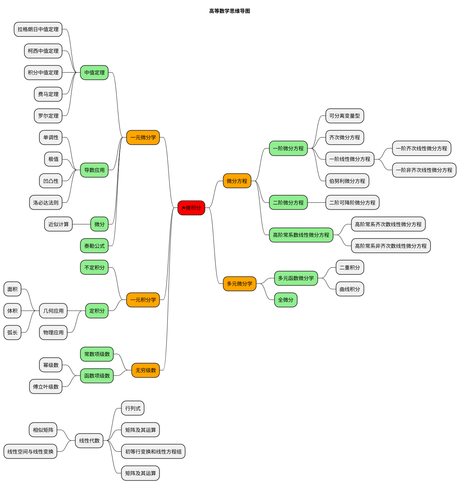

<!-- tabs:start -->
#### **①数列的极限**

<!-- panels:start -->
123
<!-- panels:end -->
#### **③函数的极限**

Ciao!

<!-- tabs:end -->

$\frac{1}{2}$

<!-- panels:start -->
<!-- div:title-panel -->

  (...) - Awesome title

<!-- div:left-panel -->

  (...) - Awesome explanation

<!-- div:right-panel -->

  (...) - Awesome example

<!-- panels:end -->

