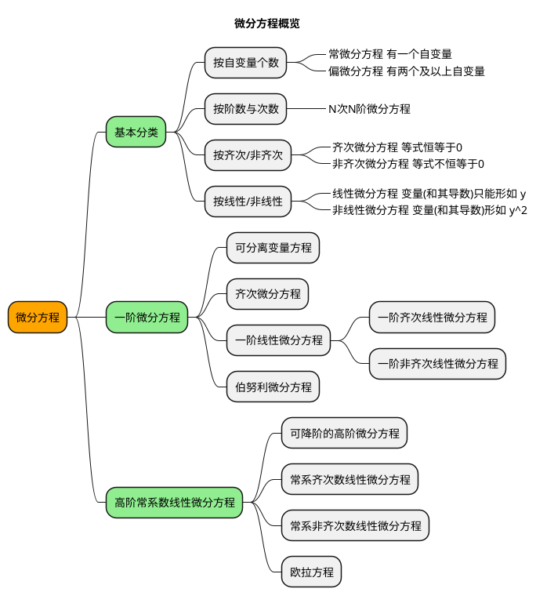

```plantuml
@startmindmap
title 微分方程概览
+[#Orange] 微分方程
++[#lightgreen] 基本分类
+++ 按自变量个数
++++_ 常微分方程 有一个自变量
++++_ 偏微分方程 有两个及以上自变量
+++ 按阶数与次数
++++_ N次N阶微分方程
+++ 按齐次/非齐次
++++_ 齐次微分方程 等式恒等于0
++++_ 非齐次微分方程 等式不恒等于0
+++ 按线性/非线性
++++_ 线性微分方程 变量(和其导数)只能形如 y
++++_ 非线性微分方程 变量(和其导数)形如 y^2
++[#lightgreen] 一阶微分方程
+++ 可分离变量方程
+++ 齐次微分方程
+++ 一阶线性微分方程
++++ 一阶齐次线性微分方程
++++ 一阶非齐次线性微分方程
+++ 伯努利微分方程
++[#lightgreen] 高阶常系数线性微分方程
+++ 可降阶的高阶微分方程
+++ 常系齐次数线性微分方程
+++ 常系非齐次数线性微分方程
+++ 欧拉方程
@endmindmap
```
> 在我们生活的这个世界上，万事万物不停变动，微分方程就是形容这些变动的好方法。  
> 微分方程就是，由含有未知函数、以及未知函数的**导数**与自变量之间的关系式。 
